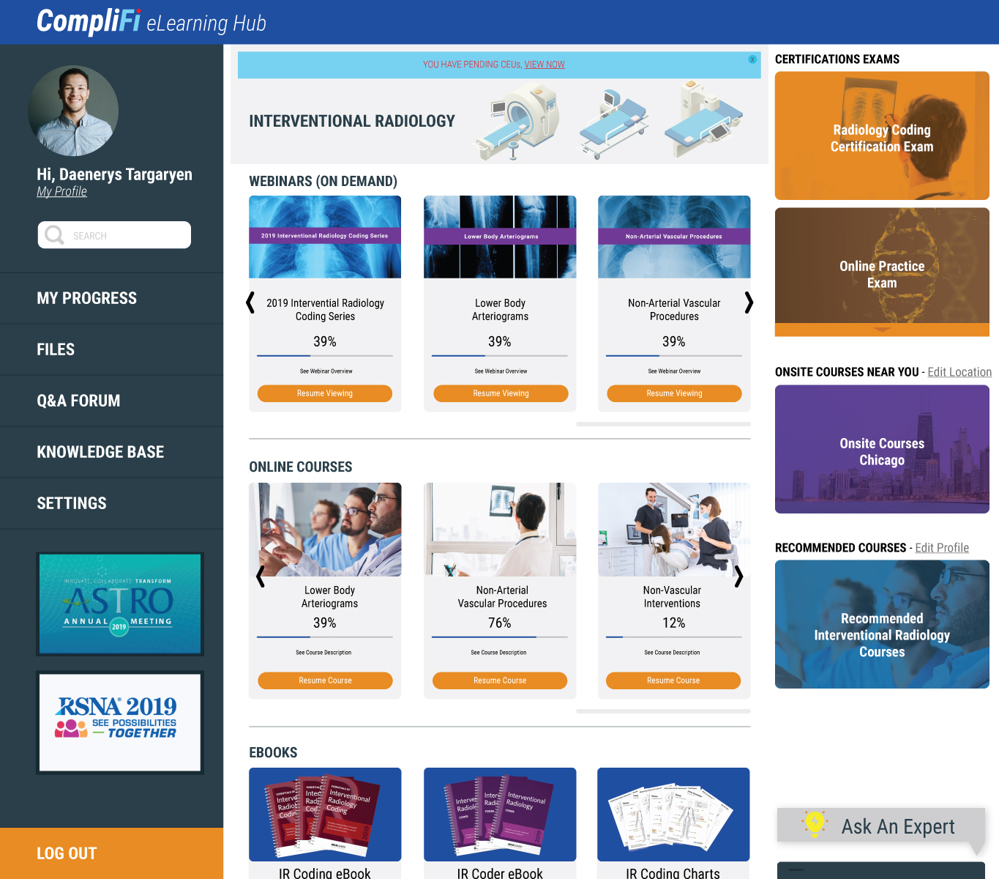

  <h2 align="center">Product & Prototype Roadmap for Complifi</h2>
  
Roadmap to bulding a scalable prototype in 2019

  

    
    
  

   

# Product Roadmap

Goal: Complifi's goal is to build a education tool in getting early stage HealthTech, BioTech, ChemTech Startups into 
regulatory compliance software. Complifi hopes to ease the process into helping companies educate and establish compliance
infrastructure and long-term strategy provide consulting refining existing processes of late state companies. 

# Phase 1: Alpha

Compliance is a tough challenge with early stage startups, reason being it slows down rapid growth of a company 
which is too slow to get a platform off the ground. As a result a lot of compliance standards are often missed for 
establishing a prototype. 

Complifi hopes to tackle this niche market in getting startups off the ground. If carried out correctly Complifi can 
successfully push towards an effective teaching and consulting tool. 

Complifi, for now, will be primarily be a single page web application written with modern front-end technologies and 
a different compliance guidelines. 

Lets take a look at the architecture. 

Overall stack:

.png)

First Compliance guideline to tackle for any health or biotech company  is Part 11 Compliance for Electronic Records.
Essentially how to validate that your platform is eligible to house patient data into your system?

Here would be a rough timeline into getting this project off the ground into a workable prototype.
 
Timeline:

# Phase 2: Beta

   Beta Phase is still TBD
  
# Phase 3: Pilot

   Pilot phase is still TBD.
   
## Useful Reading! 

Part 11 Compliance

+ "Electronic Records Compliance":
https://www.fda.gov/regulatoryinformation/guidances/ucm125067.htm

