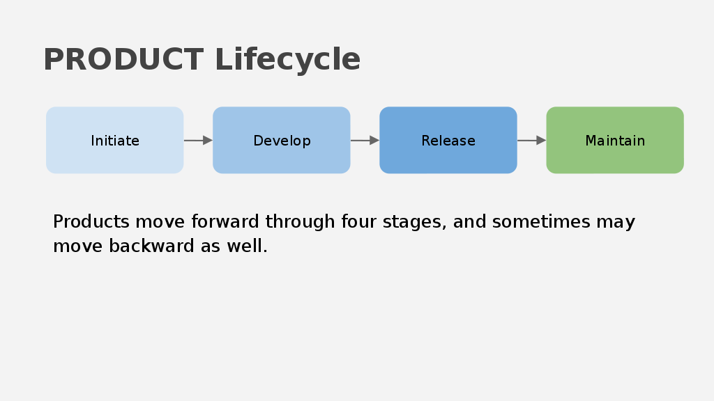
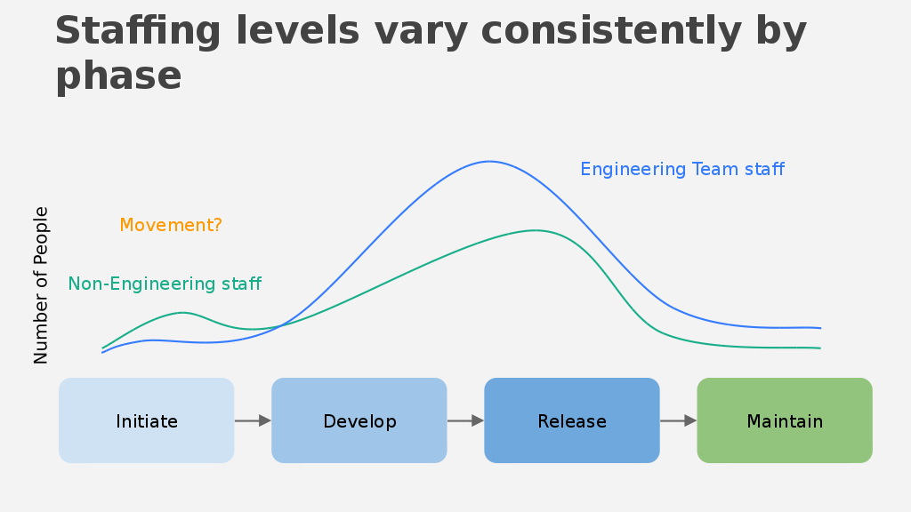

  <h2 align="center">Product & Prototype Roadmap</h2>
  
Roadmap to bulding a scalable prototype in 2019

  

    
    
  

   

# Product Roadmap

The open scientific software industry in North America is ever growing and rampant especially in here in Austin with leading local entrepreneurial campaigns such as

 - The Texas Healthcare Bioscience Institute
 - Austin Community College Bioscience Incubator
 - Capital City Innovation Life Science
 - University of Texas Dell Medical School
 And so much more... 
  
  
A driving force behind this is the continuous development is the spur of life science products. 

Prototyping involves more than just the creation of a tactile mockup. It’s both a proof of concept using off the shelf databases, software packages, and a mix of different technologies focused into a fully-functional product constructed of precision-crafted components.

For that reason, new prototype designs generally go through several  iterations before they are deemed ready for production. Whereas it’s common to think in terms of a single prototype, the process, in fact, typically results in the creation of multiple iterations.

Indeed, the design process can usually see as many as three to five different prototype phases, with a multitude of test units put through their paces.

To that end, we have partitioned the prototyping process into three classifications: what we’ll call the Alpha, Beta, and Pilot.
 
Each phase represents a step forward along a product roadmap and corresponds to an increasing score along the Technology Readiness Level scale.

It should be noted, however, that the process itself is usually nonlinear in nature, as developers will occasionally use lessons learned in various test phases to go back and revisit earlier iterations. Depending on what stage along the process you are, the tools, methods, decisions and challenges will be different.

For the sake of clarity we’ve listed prototypes in succession; however, in some cases, prototypes may be developed anywhere along the product development timeline. It’s important to realize that developers design prototypes to match the manufacturing method, so depending on changes and differences it may be necessary to push forward prototypes concurrently.

# Phase 1: Alpha

There are two important questions that we need to answer before we can get your product off the ground. 

 - Will the Product Work? 
 - How will it look and feel? 
 
 If you can answer those, we already have a start at a business plan and structuring your strategy. 
 

 However there's a lot that goes into making a prototype, the first would be establishing your architecture of your platform and
 how you will choose to manage. 
 
 One of the key failures of any software platform is structuring the right architecture tailored to your needs. It is easy to 
 get blinded by all the new technologies laid out today but lets get to the root of it. 
 
  - Your database architecture (storing your data and how you would like it structured together)
  - Your External and Internal API Layer (How your front-end will talk to your back-end and other people's back-ends)
  - The design of your front-end. 
  - Automated Testing 
  - Codebase managing 
  
  
 Ah, that's a lot to handle when undertaking a software project but it can be done simply with a little bit of planning. 
 
 Before you even start programming and developing your algorithms I would suggest about combining the first two preliminary 
 questions and how it would fit with your software. 
 
 Answering these questions about the business and software strategy will perhaps might manifest seperate prototypes but can be consolidated 
 later down the line. 
 
 The first software development prototype created a long with a roadmap with your tools and technologies will shed light on your 
 final product. However, it is strictly concerned with basic function over form and will likely bear any resemblance to the final 
 product. 
 
 Ultimately, this prototype can serve as a foundation of your process management, and the validity of your architectural design. 
 
 For support from the Mozilla foundation, it would be ample to get the software to this stage. 
 
# Phase 2: Beta

  The Beta phase of a product is for fine tuning your project, carrying your product through reviews, testing, and freezing your code 
  (that means no more features!) into a stable platform. 
  
  From testing feedback you can apply those lessons learned from earlier iterations and incorporating them as the process
  inches towards a final product. 
  
  It is also an opportunity to explore more avenues in more robust and intesive testing?
  
  - Front-end: Does the look and feel of the software feel user friendly and intuitive. 
  - API-Layer: Does this layer make sense and make use of the technologies capabilities (GraphQL and/or REST)
  - API-Layer: Does this perform well? (Do you have tests around performance)
  - Back-End: Does our schema make sense, do objects map correctly?
  - Testing: Is our tests enough, not only for user design but also our performance and validity of the data. 
  - If handling sensitive data are we compliant to FDA standards? What are our security protocols? 
  
  This level of detail requires perhaps a team of software engineers, SDET, DevOps Engineers, UI/UX folks, front-end engineers,
  and back-end architects.
  
  

  
  Towards the end of the beta test phase your product should be designed to be fully functional and virtually indistinguishable 
  in appearance from the final product. The prototype produced in the end should go through an advanced rigorous testing 
  acting to validate the system.

  This will serve to be an assessment of aesthetics, colours, textures, functionality, readiness, customer field trials, 
  overall design verification. 
  
  It can also be used as a stake for sales and marketing, allowing them to testing user experience and evaluating it's performance
  before it is brought into production. 
  
  
# Phase 3: Pilot

  The final phase is the actual deployment of your product to customers. A couple of questions needs to be asked in this step. 
  
  - How will we deploy our product in a clean and simple way?
  - How will we handle and maintain deployments after? 
  
  It can be a mess to deploy software into the cloud or into an isolated system with security. A common thing on the arise 
  is Docker | container VMWare | Virtual Machines in combination with a tool such as vagrant to spin up machines. Or if developing 
  a mobile application, how to deploy into the google or iphone market. 
  
  If you wanted to continue developing your platform how will you handle versions and upating your existing systems.
  
  - New skins, DB Migrations, and any other minor tweaks. 
  
  Once these are set the software would be ready for commercial deployment and you are ready to go! 
  
  As we've seen, the product roadmap can be broken down into three distinct phases, each one containing its own set of milestones and goals.
  From the bare-bones proof of concept models to first off the line finished products, the prototyping process represents a progression from idea to reality.

## Useful Reading! 

Product Vision and Roadmap

+ "How we built a product vision and roadmap":
https://wildbit.com/blog/2016/05/11/how-we-built-a-product-vision-and-roadmap

Code Management

+ "Code Management"
https://www.infoworld.com/article/2891434/atlassian-offers-highvolume-gitbased-code-management.html

Database Design

+ "How to build a simple database"
https://www.sqlwatchmen.com/blog/best-practices-for-database-schema-design/

API Layer
+ "Designing your API Layer"
https://www.infoq.com/news/2013/12/api-orchestration-layer

Setting up Automation Testing
+ "Testing Automation"
https://travis-ci.com/getting_started

Compliance and Security for your API's
+ "API Security"
https://www.vaultproject.io/api/

Choosing your Front-end Technology
+ "Front-End"
https://medium.freecodecamp.org/a-real-world-comparison-of-front-end-frameworks-with-benchmarks-2018-update-e5760fb4a962
